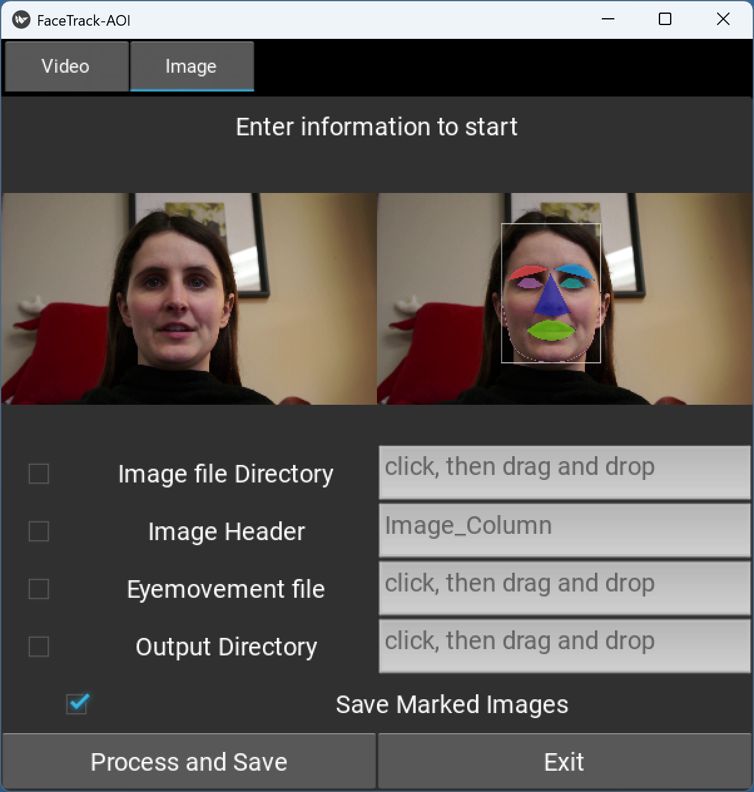

## Project Overview

This project presents a modular toolkit for facial landmark detection and fixation analysis across both image and video formats. Designed with cognitive and behavioral research in mind—such as face perception, eye-tracking analysis, and attention modeling—the toolkit enables researchers to extract precise facial feature coordinates and compare them to gaze fixation data. The modular structure supports extensibility, batch processing, and integration into experimental pipelines.

This toolkit uses Dlib’s 68-point facial landmark model, which offers a balance between precision and computational cost. This makes it suitable for large-scale studies involving naturalistic stimuli such as social videos or spontaneous facial expressions.

At present, the tool can only handle stimuli with a single face. In cases with multiple faces, it selects only the largest one.

## System Architecture

The system is divided into five major functional modules:

1. **Facial Landmark Detection in Videos**
2. **Facial Landmark Detection in Images**
3. **Fixation Comparison in Videos**
4. **Fixation Comparison in Images**
5. **Annotated Video Generation with Facial Features**

Each module is implemented as an independent component but shares a consistent internal pipeline. All landmark detection operations are built on top of Dlib’s face detector and shape predictor, while video input/output tasks rely on OpenCV.


## Algorithmic Details

### Facial Landmark Detection

Facial landmarks are extracted using the `shape_predictor_68_face_landmarks.dat` model, which returns 68 canonical points covering the jawline, eyebrows, eyes, nose, and mouth.

### Region Construction

Since the predictor does not return a full-face bounding box, the face regions is used to estimate facial boundaries. The minimal enclosing rectangle of the face regions is extended vertically (a jaw height) to include upper facial regions. Additional bounding boxes are generated around each region of interest using empirically chosen amplification factors:

| Region   | X-axis Amplification | Y-axis Amplification |
| -------- | -------------------- | -------------------- |
| Eyebrows | 1.2                  | 1.2                  |
| Eyes     | 1.8                  | 2.5                  |
| Nose     | 2.0                  | 1.2                  |
| Mouth    | 1.3                  | 1.2                  |

These values can be configured in the `main_module.py` to suit different datasets. We also provide a function that enables the enlargement of an AOI based on a specified magnified visual angle, which can be activated by setting `use_degree=True` in the `return_scaled_shape` function in the `main_module.py`.

Besides, researchers can customize their own area of interest by modifying `REGIONS` and `return_scaled_shape` in the `main_module.py`.

### Fixation Comparison

Each fixation coordinate is compared against the polygon contour (e.g., eye/mouth boundaries extracted via facial landmarks)  of each facial region. Binary inclusion results are recorded, and pixel areas of the regions are calculated for further analysis (e.g., area normalization of fixation counts).

### Annotated Video Generation

The `process_videos` function enables the generation of videos with overlaid facial landmarks. It leverages OpenCV’s `cv2.VideoWriter` to write frame-by-frame annotated outputs. Multithreading is supported via the `max_workers` parameter to facilitate parallel processing of video batches.

## Technical Dependencies

- **Programming Language**: Python 3.7+
- **Libraries**:
  - `numpy`
  - `opencv-python`
  - `dlib`
  - `pandas`
  - `tqdm` (for progress monitoring)
  - `moviepy`
  - `kivy` (for GUI)
  - `ffpyplayer` (for GUI)
- **Pre-trained Model**: `shape_predictor_68_face_landmarks.dat` (Dlib)

All required libraries can be installed via `pip` or 'conda', and the model can be downloaded from the official Dlib repository. For 'conda' installation instructions, please refer to the "Installation" section.

## Input and Output Formats

### Facial Landmark CSV Files

- **Input**: Video or image files (file type can be specified via command-line options; see below).
- **Output**: One `.csv` file per video, or a single `.csv` for multiple images.
- **Output Fields**: Frame index (or image name) and the coordinates of each facial landmark point.

### Fixation Data Format
The tool works with typical eye-tracking data exported from commercial eye-trackers (e.g., Eyelink, Tobii) and custom experimental setups, as long as the data includes the requisite spatial and temporal fields for analysis. 
Corresponding eye movement data exported from the vendor's exported files (e.g., fixation reports exported from Eyelink DataViewer or Tobii Pro Lab) or custom data. The input data must be a tab-delimited file containing the gaze point coordinates (X and Y) as well as task-specific fields—for example, video-based datasets require columns for the video name and frame index, whereas image-based datasets require a column indicating the image name (see example data for details). 


#### DataViewer Export
Required Fields:
  - `CURRENT_FIX_X` and `CURRENT_FIX_Y`: fixation coordinate in pixels;
  - `VIDEO_NAME_END` and  `VIDEO_FRAME_INDEX_END`: for video filename and frame index reference;
  - Or a column containing image names.

#### Tobii Pro Lab Export
Required Fields:
  - `Fixation point X` and `Fixation point Y`: fixation coordinate in pixels;
  - A column containing video or image names (e.g., `Presented Media name`).

#### Output
The processed fixation file will include additional columns:
  - `CURRENT_IA_<region>`: Binary indicator (1 = inside region, 0 = outside);
  - `CURRENT_Area_<region>`: Pixel area of the region.


## Installation
Before running the GUI or command-line version of FaceTrack-AOI, you need to set up the runtime environment. We strongly recommend using a virtual environment to keep dependencies isolated and manageable. Below is an example setup using Miniconda:

1. Install [Miniconda](https://www.anaconda.com/docs/getting-started/miniconda/main).
2. Open the Anaconda Prompt and create a new virtual environment (e.g., named `facetrack`):
```bash
conda create -n facetrack python
```
3. Activate the `facetrack` environment:
```bash
conda activate facetrack
```
4. Install required dependencies:
```bash
conda install numpy pandas tqdm
conda install -c conda-forge opencv dlib moviepy
conda install -c conda-forge kivy
pip install ffpyplayer
```
5. Launch Python in this environment and run the following command to confirm all dependencies were installed successfully:
```python
import numpy, cv2, dlib, pandas, tqdm, moviepy, kivy
```

6. If installation fails, close and reopen the Miniconda terminal, then reconfigure using:
```
conda remove -n facetrack --all
conda create -n facetrack python=3.13 numpy pandas tqdm opencv dlib moviepy kivy -c conda-forge
conda activate facetrack
```

## Usage (for GUI user)
Launch it by running the following command in the `facetrack` environment terminal:

```bash
python ./facedetection_gui.py
```

Here, `./facedetection_gui.py` refers to the path of the script.

After running the command, the GUI window will appear as shown below:

---

### Video Tab


The **Video** tab includes the following options:

| Options         | Description |
|-----------------|-------------|
| `Video Stimuli Directory` | Directory containing video files |
| `Eyemovement Data`        | Path to fixation data file |
| `Output Directory`        | Directory for saving results |
| `Save Raw Images`         | Save unprocessed video frames |
| `Save Marked Images`      | Save AOI-marked video frames |

After configuring the options, click **Process and Save** to start processing. Click **Exit** to close the application.

---

### Image Tab



The **Image** tab provides the following options:

| Options         | Description |
|-----------------|-------------|
| `Image file Directory`    | Directory containing image files |
| `Image Header`            | The name of the column containing image filenames (no need to add quotes) |
| `Eyemovement file`        | Path to fixation data file |
| `Output Directory`        | Directory for saving results |
| `Save Marked Images`      | Save AOI-marked images |

After setting the parameters, click **Process and Save** to run the process.
Click **Exit** to close the application.


## Usage (for Command-Line Users)

This toolkit is generally used in two steps:  
1. Detect facial landmarks
2. Compare fixations/gaze to facial regions

---

### 1. Facial Landmark Detection

We provide two modules for facial landmark detection:

- **`detect_images.py`** — for static images
- **`detect_videos.py`** — for videos

#### Images

Use the `process_images` function in `detect_images.py` with the following parameters:

| Parameter      | Description |
|----------------|-------------|
| `image_dir`    | Directory of facial stimulus images |
| `output_dir`   | Directory for output CSV files and optionally AOI-marked images (`save_marked=True`) |
| `model_path`   | Path to the pre-trained model (e.g., `shape_predictor_68_face_landmarks.dat`) |
| `save_marked`  | Whether to save AOI-marked images (set to `False` by default)|

#### Videos

Use the `process_all_videos` function in `detect_videos.py` with these parameters:

| Parameter       | Description |
|-----------------|-------------|
| `video_dir`     | Directory containing videos |
| `output_dir`    | Directory for CSV outputs and optional images |
| `model_path`    | Path to the pre-trained model |
| `save_raw`      | Whether to save raw video frames (set to `False` by default) |
| `save_marked`   | Whether to save AOI-marked frames (set to `False` by default) |
| `video_filter`  | Video file extension |
| `max_workers`   | Maximum number of CPU workers (set to `8` by default) |

**Note:** The returned x- and y-coordinates are based on the original image or video size. For fixation comparison, you may need to restore the size and position of the image or video according to the experiment screen settings.

---

### 2. Fixation Comparison

Two modules are provided to compare fixations with facial regions:

- `comparision_fixation_images.py`  — for image stimuli experiment
- `comparision_fixation_videos.py`  — for video stimuli experiment

These two modules determine whether fixations fall within facial regions and return corresponding indicators along with the pixel area of each ergion.

#### Images

Use the `process_fixation_image` function in `comparision_fixation_images.py` with the following parameters:

| Parameter        | Description |
|------------------|-------------|
| `input_path`     | Path to the fixation file |
| `csvtable_path`  | Path to the facial landmarks CSV |
| `image_column`   | The name of the column containing image filenames |
| `fix_x_column`   | The name of the column containing the X-axis coordinates (set to `"CURRENT_FIX_X"` by default) |
| `fix_y_column`   | The name of the column containing the Y-axis coordinates (set to `"CURRENT_FIX_Y"` by default) |
| `output_path`    | Path to output file |

#### Videos

Use the `process_fixation_video` function in `comparision_fixation_videos.py` with the following parameters:

| Parameter           | Description |
|---------------------|-------------|
| `input_path`        | Path to fixation file |
| `csvtable_dir`      | Directory of facial landmark CSVs |
| `fix_x_column`      | The name of the column containing the X-axis coordinates (set to `"CURRENT_FIX_X"` by default) |
| `fix_y_column`      | The name of the column containing the Y-axis coordinates (set to `"CURRENT_FIX_Y"` by default) |
| `video_name_column` | The name of the column containing the video names (set to `"VIDEO_NAME_END"` by default) |
| `frame_index_column`| The name of the column containing the video frame index (set to `"VIDEO_FRAME_INDEX_END"` by default) |
| `video_filter`      | Video file extension |
| `output_path`       | Path to output file |

These column names are configured for EyeLink DataViewer exports. If your data file uses different column names, update the corresponding parameters accordingly.

---

### Example Usages

#### Image Stimuli Experiment

```python
# Step 1: Detect Facial Landmarks

from detect_images import process_images

process_images(
    image_dir = "./example/example_stimuli/Images",
    output_dir = "./example/example_stimuli/Images/output",
    model_path = "./model/shape_predictor_68_face_landmarks.dat",
    save_marked = True
)

# Step 2: Compare Fixations to Facial Regions

from comparision_fixation_images import process_fixation_image

process_fixation_image(
    input_path = "./example/Data_Pre-Processed/fixation_data_image.txt",
    csvtable_path = "./example/example_stimuli/Images/output/landmarks.csv",
    image_column = "Image_Column",
    fix_x_column = "CURRENT_FIX_X",
    fix_y_column = "CURRENT_FIX_Y",
    output_path = "./example/Data_output/fixation_data_image_out.csv",
)
```

#### Video Stimuli Experiment

```python
# Step 1: Detect Facial Landmarks

from detect_videos import process_all_videos

process_all_videos(
    video_dir = "./example/example_stimuli/videos",
    output_dir = "./example/example_stimuli/videos/output",
    model_path = "./model/shape_predictor_68_face_landmarks.dat",
    save_raw = True,
    save_marked = True,
    video_filter = ".mp4",
    max_workers = 8
)

# Step 2: Compare Fixations to Facial Regions

from comparision_fixation_videos import process_fixation_video

process_fixation_video(
    input_path = "./example/Data_Pre-Processed/fixation_data_video.txt",
    csvtable_dir = "./example/example_stimuli/videos/output",
    fix_x_column = "CURRENT_FIX_X",
    fix_y_column = "CURRENT_FIX_Y",
    video_name_column = "VIDEO_NAME_END",
    frame_index_column = "VIDEO_FRAME_INDEX_END",
    video_filter = ".mp4",
    output_path = "./example/Data_output/fixation_data_video_out.csv"
)
```

#### Generate Annotated Videos

```python
from facial_video_processor import process_videos

process_videos(
    video_dir = "./example/example_stimuli/videos",
    output_dir = "./example/example_stimuli/videos/output",
    model_path = "./model/shape_predictor_68_face_landmarks.dat",
    max_workers = 8
)
```

## Citation

To be done.
