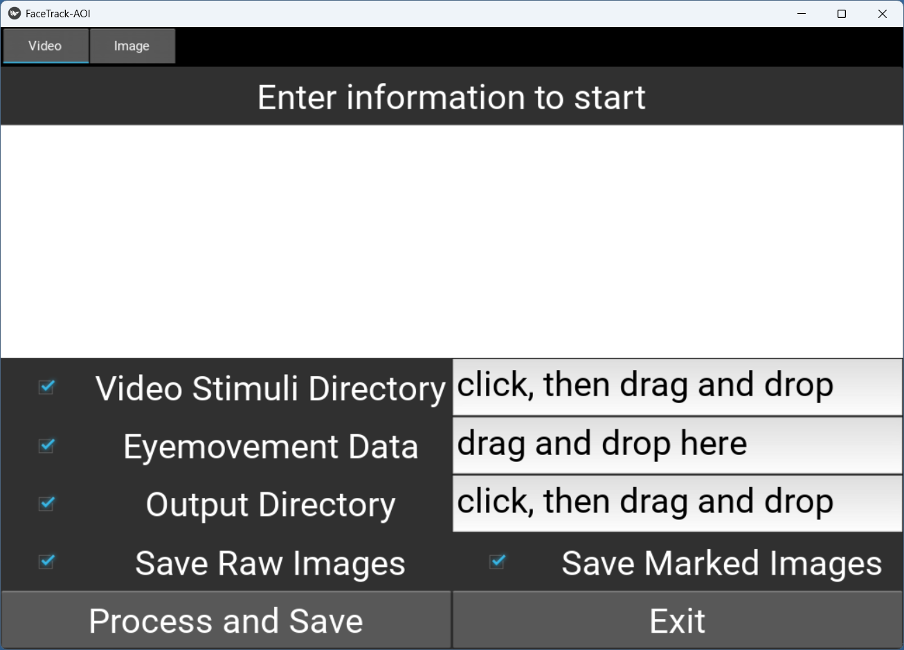

## Project Overview

This project presents a modular toolkit for facial landmark detection and fixation analysis across both image and video formats. Designed with cognitive and behavioral research in mind—such as face perception, eye-tracking analysis, and attention modeling—the toolkit enables researchers to extract precise facial feature coordinates and compare them to gaze fixation data. The modular structure supports extensibility, batch processing, and integration into experimental pipelines.

This toolkit uses Dlib’s 68-point facial landmark model, which offers a balance between precision and computational cost. This makes it suitable for large-scale studies involving naturalistic stimuli such as social videos or spontaneous facial expressions.

At present, the tool can only handle stimuli with a single face. In cases with multiple faces, it selects only the largest one.

## System Architecture

The system is divided into five major functional modules:

1. **Facial Landmark Detection in Videos**
2. **Facial Landmark Detection in Images**
3. **Fixation Comparison in Videos**
4. **Fixation Comparison in Images**
5. **Annotated Video Generation with Facial Features**

Each module is implemented as an independent component but shares a consistent internal pipeline. All landmark detection operations are built on top of Dlib’s face detector and shape predictor, while video I/O tasks rely on OpenCV.

## Input and Output Formats

### Facial Landmark CSV Files

- **Input**: Video or image files
- **Output**: A `.csv` file per video or a combined `.csv` for images
- **Fields**: Frame index (or image name), coordinates of each facial landmark point

### Fixation Data Format

- **Required Fields**:
  - `VIDEO_NAME_END`: (for video) filename reference (EyeLink)
  - `VIDEO_FRAME_INDEX_END`: (for video) specifies the frame to match (EyeLink)
  - `CURRENT_FIX_X`, `CURRENT_FIX_Y`: fixation coordinate in pixels (EyeLink)
  - `Fixation point X`, `Fixation point Y` fixation coordinate in pixels (Tobii)
- **Output: New columns are added to fixation data**:
  - `CURRENT_IA_<region>`: binary indicator (1 = inside region, 0 = outside)
  - `CURRENT_Area_<region>`: pixel area of the region
s
## Algorithmic Details

### Facial Landmark Detection

Facial landmarks are extracted using the `shape_predictor_68_face_landmarks.dat` model, which returns 68 canonical points covering the jawline, eyebrows, eyes, nose, and mouth.

### Region Construction

Since the predictor does not return a full-face bounding box, the jaw region is used to estimate facial boundaries. The minimal enclosing rectangle of the jaw is extended vertically to include upper facial regions. Additional bounding boxes are generated around each region of interest using empirically chosen amplification factors:

| Region   | X-axis Amplification | Y-axis Amplification |
| -------- | -------------------- | -------------------- |
| Eyebrows | 1.2                  | 1.2                  |
| Eyes     | 1.5                  | 2.0                  |
| Nose     | 2.0                  | 1.2                  |
| Mouth    | 1.3                  | 1.2                  |

These values can be configured in the `main_module.py` to suit different datasets.

### Fixation Comparison

Each fixation coordinate is compared against the bounding box of each facial region. Binary inclusion results are recorded, and pixel areas of the regions are calculated for further analysis (e.g., area normalization of fixation counts).

## Annotated Video Generation

The `process_videos` function enables the generation of videos with overlaid facial landmarks. It leverages OpenCV’s `cv2.VideoWriter` to write frame-by-frame annotated outputs. Multithreading is supported via the `max_workers` parameter to facilitate parallel processing of video batches.

## Technical Dependencies

- **Programming Language**: Python 3.7+
- **Libraries**:
  - `numpy`
  - `opencv-python`
  - `dlib`
  - `pandas`
  - `tqdm` (for progress monitoring)
  - `moviepy`
  - `kivy` (for GUI)
- **Pre-trained Model**: `shape_predictor_68_face_landmarks.dat` (Dlib)

All required libraries can be installed via `pip`, and the model can be downloaded from the official Dlib repository.

## Usage (for GUI user)

To launch the GUI, run the following command in your terminal:

```python
python .\facedetection_gui.py
```

Here, `.\facedetection_gui.py` refers to the path of the script.

After running the command, the GUI window will appear as shown below:

---

### Video Tab



The **Video** tab includes the following options:

| Options         | Description |
|-----------------|-------------|
| `Video Stimuli Directory` | Directory containing video files |
| `Eyemovement Data`        | Path to fixation data file |
| `Output Directory`        | Directory for saving results |
| `Save Raw Images`         | Save unprocessed video frames |
| `Save Marked Images`      | Save AOI-marked video frames |

After configuring the options, click **Process and Save** to start processing. Click **Exit** to close the application.

---

### Image Tab


The **Image** tab provides the following options:

| Options         | Description |
|-----------------|-------------|
| `Image file Directory`    | Directory containing image files |
| `Image Header`            | Column name containing image filenames |
| `Eyemovement file`        | Path to fixation data file |
| `Output Directory`        | Directory for saving results |
| `Save Raw Images`         | Save original images (this is an useless option)|
| `Save Marked Images`      | Save AOI-marked images |

After setting the parameters, click **Process and Save** to run the process.
Click **Exit** to close the application.


## Usage (for Command-Line Users)

This toolkit is generally used in two steps:  
1. Detect facial landmarks  
2. Compare fixations to facial regions

---

### 1. Facial Landmark Detection

We provide two modules for facial landmark detection:

- **`detect_images.py`** — for static images  
- **`detect_videos.py`** — for videos  

#### Images

Use the `process_images` function in `detect_images.py` with the following parameters:

| Parameter      | Description |
|----------------|-------------|
| `image_dir`    | Directory of facial stimulus images |
| `output_dir`   | Directory for output CSV files and optionally AOI-marked images (`save_marked=True`) |
| `model_path`   | Path to the pre-trained model (e.g., `shape_predictor_68_face_landmarks.dat`) |
| `save_marked`  | Whether to save AOI-marked images |

#### Videos

Use the `process_all_videos` function in `detect_videos.py` with these parameters:

| Parameter       | Description |
|-----------------|-------------|
| `video_dir`     | Directory containing videos |
| `output_dir`    | Directory for CSV outputs and optional images |
| `model_path`    | Path to the pre-trained model |
| `save_raw`      | Whether to save raw video frames |
| `save_marked`   | Whether to save AOI-marked frames |
| `max_workers`   | Maximum number of CPU workers |

**Note:** The returned x- and y-coordinates are based on the original image or video size. For fixation comparison, you may need to restore the size and position of the image or video according to the experiment screen settings.

---

### 2. Fixation Comparison

Three modules are provided to compare fixations with facial regions:

- `comparision_fixation_images_eyelink.py`  
- `comparision_fixation_images_tobii.py`  
- `comparision_fixation_videos_eyelink.py`  

These modules determine whether fixations fall within facial regions and return corresponding indicators along with the pixel area of each ergion.

#### Images (EyeLink)

Use the `process_fixation_image` function in `comparision_fixation_images_eyelink.py` with the following parameters:

| Parameter        | Description |
|------------------|-------------|
| `input_txt_path` | Path to the fixation file |
| `csvtable_path`  | Path to the facial landmarks CSV |
| `imagecolumn`    | Column name containing image filenames |
| `output_path`    | Path to output file (e.g., `./output_fixation.txt`) |
| `y_adjust`       | Y-axis adjustment for EyeLink data |

#### Images (Tobii)

Use the `process_fixation_image` function in `comparision_fixation_images_tobii.py` with the following parameters:

| Parameter        | Description |
|------------------|-------------|
| `input_folder`   | Directory of fixation files |
| `output_folder`  | Directory for output files |
| `csvtable_path`  | Path to the facial landmarks CSV |
| `imagecolumn`    | Column name containing image filenames |
| `y_adjust`       | Y-axis adjustment for EyeLink data |
| `extensions`     | Fixation file extension |

#### Videos (EyeLink)

Use the `process_fixation_video` function in `comparision_fixation_videos_eyelink.py` with the following parameters:

| Parameter           | Description |
|---------------------|-------------|
| `input_txt_path`    | Path to fixation file |
| `input_CSVtable_dir`| Directory of facial landmark CSVs |
| `videofilter`       | Video file extension |
| `output_csv_path`   | Path to output file (e.g., `./output_fixation.txt`) |
| `y_adjust`          | Y-axis adjustment for EyeLink data |

#### Fixation File Formats

- **EyeLink:** Tab-separated text file  
- **Tobii:** Tab-separated text file with `.tsv` extension

---

### Example Usages

#### Video Stimuli for EyeLink Experiment

```python
# 1. Detect Facial Landmarks

from detect_videos import process_all_videos

process_all_videos(
    video_dir = "./videos",
    output_dir = "./videos/output",
    model_path = "./model/shape_predictor_68_face_landmarks.dat",
    save_raw = True,
    save_marked = True
)

# 2. Compare Fixations to Facial Regions

from comparision_fixation_videos_eyelink import process_fixation_video

process_fixation_video(
    input_txt_path = "./video_fixation_data.txt",
    input_CSVtable_dir = "./videos/output",
    videofilter = ".mp4",
    output_csv_path = "./output/output_video_fixation_data.csv"
)
```

#### Image Stimuli for EyeLink Experiment

```python
# 1. Detect Facial Landmarks

from detect_images import process_images

process_images(
    image_dir = "./images",
    output_dir = "./images/output",
    model_path = "./model/shape_predictor_68_face_landmarks.dat",
    save_marked = True
)

# 2. Compare Fixations to Facial Regions

from comparision_fixation_images_eyelink import process_fixation_image

process_fixation_image(
    input_txt_path = "./fixation_data.txt",
    csvtable_path = "./images/output/all_landmarks.csv",
    imagecolumn = "image_column",
    output_path = "./output/output_fixation_data.csv",
)
```

#### Image Stimuli for Tobii Experiment

```python
# 1. Detect Facial Landmarks

from detect_images import process_images

process_images(
    image_dir = "./images",
    output_dir = "./images/output",
    model_path = "./model/shape_predictor_68_face_landmarks.dat",
    save_marked = True
)

# 2. Compare Fixations to Facial Regions

from comparision_fixation_images_tobii import process_fixation_image

process_fixation_image(
    input_folder = "./fixation_data",
    output_folder = "./fixation_data/output",
    csvtable_path = "./images/output/all_landmarks.csv",
    imagecolumn = "Presented Media name"
)
```

#### Generate Annotated Videos

```python
from facial_video_processor import process_videos

process_videos(
    video_dir = "./videos",
    output_dir = "./videos/annotated_videos",
    model_path = "./shape_predictor_68_face_landmarks.dat",
    max_workers = 4
)
```

## Citation

To be done.

